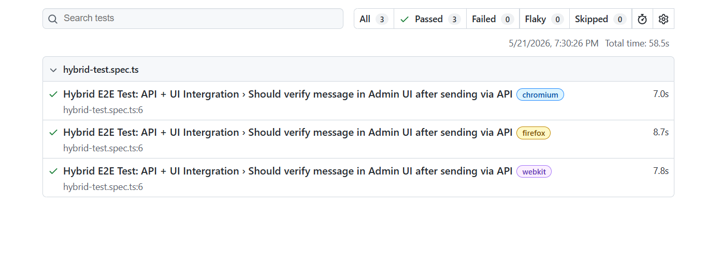

<div align="center">
  
  <h1>🚀 Playwright Hybrid E2E Automation Framework</h1>
  <p><i>Next-Generation UI & API Integrated Testing Framework for Blazing Fast Execution</i></p>

  <!-- Badges -->
  <p>
    
    
    
    
  </p>
</div>

---

## 📖 The "Wow" Factor: Why Hybrid Testing?
Traditional UI automation tests are known to be slow and brittle because they rely on the UI to create test data. **This framework changes the game.** 

By utilizing a **Hybrid Approach**, we use Playwright's `APIRequestContext` to bypass the UI and inject data directly into the database via Backend APIs. The UI is then used strictly for what it's meant to do—asserting the final visual state. 

✅ **Result:** Test execution speed is increased by over 50%, and flakiness is practically eliminated.

<br>

## 📸 Framework in Action
*(Screenshot of the Playwright UI mode or Test passing terminal goes here)*


<br>

## 🏗️ Architectural Patterns Used
1. **Page Object Model (POM):** Complete separation of UI interactions from test logic.
2. **API Data Seeding:** Using `utils/apiHelper.ts` to generate dynamic preconditions.
3. **Data Independence:** Using `Date.now()` to create unique identifiers (e.g., Subject lines) preventing data collisions during parallel execution.
4. **Resilient Locators:** Using user-centric locators like `getByPlaceholder` and `getByRole`.

## 📂 Project Structure
```text
├── assets/                 # Contains README images/screenshots
├── pages/                  # Page Object classes (The Maps)
│   └── AdminPage.ts        # Locators and methods for the Admin Panel
├── tests/                  # Test suites (The Master Plans)
│   └── hybrid-test.spec.ts # Hybrid E2E integration test
├── utils/                  # Helper utilities (The Secret Tunnels)
│   └── apiHelper.ts        # API POST methods for instant data injection
├── package.json            # Node.js dependencies
└── playwright.config.ts    # Global Playwright configurations